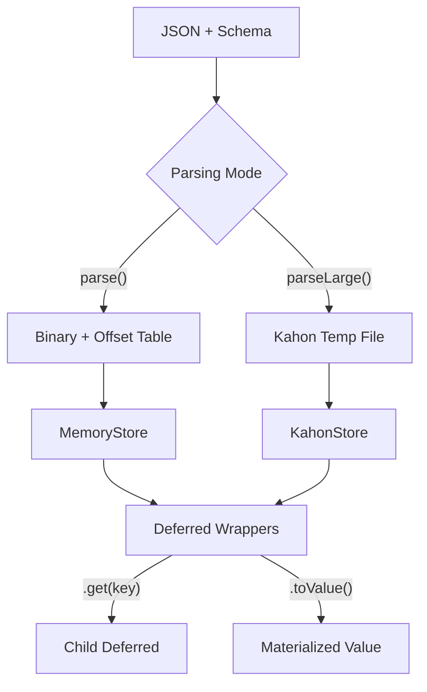

# Deferred Evaluation

Atchara wraps all parsed values in **deferred types** that enable on-demand value access without materializing unused data.

## How It Works



1. **Native parsing** produces values in a storage backend — binary buffer (direct) or a temp `.kahon` file (streaming)
2. **ValueStore** (MemoryStore or KahonStore) provides path-based access without decoding everything upfront
3. **Deferred wrappers** hold a reference to the store and their path, creating child wrappers on navigation
4. **Materialization** happens only when `.toValue()` is called

## Deferred Types

All schema types have corresponding deferred wrappers:

| Schema Type                                      | Deferred Wrapper       | Key Methods                                                           |
| ------------------------------------------------ | ---------------------- | --------------------------------------------------------------------- |
| `string()`, `number()`, `boolean()`, `literal()` | `DeferredPrimitive<T>` | `toValue()`                                                           |
| `object({...})`                                  | `DeferredObject<T>`    | `get(key)`, `has(key)`, `keys()`, `toValue()`                         |
| `array(...)`                                     | `DeferredArray<T>`     | `at(index)`, `length()`, `[Symbol.asyncIterator]`, `toValue()`        |
| `record(...)`                                    | `DeferredRecord<V>`    | `get(key)`, `keys()`, `size()`, `[Symbol.asyncIterator]`, `toValue()` |
| `tuple([...])`                                   | `DeferredTuple<T>`     | `at(index)`, `toValue()`                                              |
| `nullable(...)`                                  | `DeferredNullable<T>`  | `toValue()`                                                           |
| `union([...])`                                   | `DeferredUnion<T>`     | `toValue()`                                                           |

All wrappers implement `DeferredValue<T>` with a common `toValue(): Promise<T>` method.

## Usage

### Selective Field Access

```typescript
const User = object({
  name: string(),
  email: string(),
  profile: object({ bio: string(), avatar: string() }),
})

const result = User.parse(jsonBytes)

// Access only what you need - other fields stay as binary
const name = await result.get('name').toValue()
const bio = await result.get('profile').get('bio').toValue()
```

### Array Iteration

```typescript
const Items = array(object({ id: number(), data: string() }))
const result = Items.parse(jsonBytes)

// Iterate lazily - each element decoded on access
for await (const item of result) {
  console.log(await item.get('id').toValue())
}

// Or access by index
const first = await (await result.at(0))?.toValue()
```

### Full Materialization

```typescript
// When you need the complete JavaScript value
const fullValue = await result.toValue()
```

## Architecture

### ValueStore Interface

Deferred wrappers query a `ValueStore` for data access:

```typescript
interface ValueStore {
  get(path: string[]): Promise<unknown>
  has(path: string[]): Promise<boolean>
  getArrayLength(path: string[]): Promise<number>
  getRecordKeys(path: string[]): Promise<string[]>
  getFieldMetadata(path: string[], key: string): FieldMetadata
  getDefs(): SerializedSchema[]
}
```

`get`, `has`, `getArrayLength`, and `getRecordKeys` are async because the streaming backend reads from disk. `getFieldMetadata` and `getDefs` are schema-derived and stay synchronous.

### Path-Based Navigation

Each deferred wrapper tracks its location in the data structure via a path array:

```typescript
// result.get('user').get('profile').get('name').toValue()
// Internally builds path: ['user', 'profile', 'name']
// MemoryStore.get(['user', 'profile', 'name']) decodes just that value
```

### Store Implementations

Two `ValueStore` implementations back deferred wrappers:

**MemoryStore** — used by `parse()`:

- Operates on the in-memory binary buffer with an embedded offset table
- **Offset table**: Pre-computed byte positions for schema-defined paths enable O(1) jumps
- **On-demand decoding**: Values decoded from binary only when `get()` is called
- **Schema navigation**: Uses schema structure to locate dynamic elements (array indices, record keys)

**KahonStore** — used by `parseLarge()`:

- Reads from a temp `.kahon` file (random-access B+tree document) written during streaming parsing
- **Native containers**: Kahon's array and object containers cover path-based lookups directly — no per-path key encoding
- **Async access**: All read methods return promises, since values are loaded from disk on demand
- **Explicit lifecycle**: Must be closed via `LargeParseResult.close()` to delete the temp file

## Type Inference

TypeScript infers deferred types from schemas:

```typescript
import { InferDeferred, InferValue } from 'atchara'

const User = object({ name: string(), age: number() })

type UserValue = InferValue<typeof User>
// { name: string; age: number }

type UserDeferred = InferDeferred<typeof User>
// DeferredObject<{ name: string; age: number }>
```

## Performance

| Operation          | Cost                                |
| ------------------ | ----------------------------------- |
| `parser.parse()`   | Full JSON parse + binary encode     |
| `result.get(key)`  | O(1) wrapper creation (no decoding) |
| `result.at(index)` | O(n) skip to element                |
| `result.toValue()` | Decode from binary to JS value      |
| `record.get(key)`  | O(log n) hash-based lookup          |
