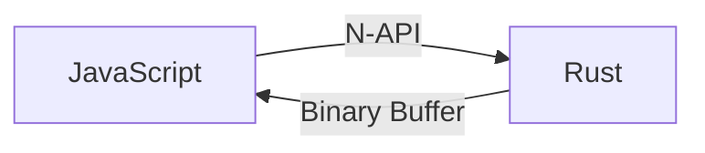

# Design Decisions

## Why Rust + N-API?



JavaScript's `JSON.parse()` is highly optimized but fundamentally limited:

- Returns untyped `any`, requiring a second validation pass
- Parses everything generically, even fields you don't need
- Creates intermediate JS objects that are immediately discarded during validation

Rust via N-API solves this:

- **Single pass**: Validate against schema while parsing (no double work)
- **Native performance**: Rust is 10-100x faster for CPU-bound parsing
- **Zero-copy input**: `Uint8Array` crosses JS/Rust boundary without copying
- **Minimal JS overhead**: N-API is the stable, low-overhead Node.js addon API

Trade-off: Adds native dependency complexity (build tooling, platform binaries).

## Why Binary Encoding?

The native parser outputs a compact binary format instead of JS objects:

| Approach                 | Overhead                            |
| ------------------------ | ----------------------------------- |
| Build JS objects in Rust | N-API call per value, slow          |
| Return JSON string       | Re-parse in JS, defeats purpose     |
| Binary encoding          | Single buffer transfer, fast decode |

Binary format advantages:

- **Compact**: No type tags for known schemas, field indices instead of names
- **Fast transfer**: Single `Buffer` crosses N-API boundary
- **Cheap decode**: TypeScript reads binary using `DataView` (native ops)
- **Offset table**: Enables O(1) access to schema-indexed positions

Trade-off: Decoding still required on the TypeScript side, though it's cheap via `DataView`.

## Why Schema-First?

Atchara requires schemas upfront rather than inferring from JSON:

```typescript
const User = object({ name: string(), age: number() })
const result = User.parse(jsonBytes)
```

This enables:

1. **Compile-time types**: Phantom types give TypeScript exact inference
2. **Faster parsing**: Parser knows expected structure, skips generic handling
3. **Better errors**: "Expected number for field 'age'" vs "Unexpected token"
4. **Schema compilation**: Deserialize schema once in `Atchara::new()`, amortize across many parses

Trade-off: Cannot parse arbitrary unknown JSON (use `JSON.parse()` for that).

## Uint8Array Input

The parser accepts `Uint8Array` instead of strings:

- **Zero-copy**: Data from `fetch()`, files, or sockets is already bytes
- **No encoding overhead**: String-to-bytes conversion happens once at source
- **Rust-friendly**: Rust operates on `&[u8]`, no string conversion needed

Trade-off: Caller must encode strings (`new TextEncoder().encode(str)`).

## Offset-Table Object Encoding

Objects use a fixed-size offset table followed by field values:

```
[offset_0: u32][offset_1: u32]...[offset_{n-1}: u32][values...]
```

Each offset is relative to the start of the values section. Absent optional fields use sentinel `0xFFFFFFFF`. Values are stored in schema order.

Why offset tables?

- **O(1) random access**: Jump directly to any field without scanning
- **Schema-driven sizing**: Field count known at encode time from schema
- **Backpatching**: Offsets written after values are encoded, allowing streaming writes
- **Absent optionals**: Single sentinel value avoids flag bytes

Trade-off: 4 bytes per field in the offset table, even for small objects.

## Schema Compilation at Construction

Schema is deserialized once when the parser is created:

```typescript
const User = object({ name: string(), age: number() })
// Schema serialized and sent to Rust at construction ^

User.parse(bytes1) // Fast: reuses compiled schema
User.parse(bytes2) // Fast: no schema overhead
```

Each schema builder (e.g., `object()`, `array()`) returns a `Parser<T>` that wraps a `NativeParser`. The `NativeParser` constructor serializes the schema to JSON and passes it to Rust's `Atchara::new()`, which deserializes it once into optimized Rust data structures.

Why not compile per-parse?

- **Amortized cost**: Schema deserialization is expensive relative to small parses
- **Native optimization**: Rust can build optimized data structures (HashMaps for object fields)
- **Index assignment**: Schema nodes get indices for offset table during compilation

## Phantom Types

```typescript
interface Schema<TOutput> {
  readonly _output: TOutput // Compile-time only
}
```

The `_output` property doesn't exist at runtime. TypeScript uses it for type inference only.

Why phantom types?

- **Zero runtime cost**: No actual property, just type information
- **Full inference**: `InferValue<typeof User>` extracts the exact type
- **Composition**: Types compose correctly through nested schemas

## Deferred Evaluation

All parse results are wrapped in deferred types:

```typescript
const result = User.parse(bytes) // DeferredObject<User>
const name = result.get('name').toValue() // Access on-demand
```

Why not return plain values?

- **Lazy decoding**: Only accessed fields are decoded from binary
- **ValueStore abstraction**: Decouples deferred types from storage backend (MemoryStore for direct, KahonStore for streaming)
- **Consistent API**: All access goes through `.get()` / `.toValue()` regardless of parsing mode

Navigating with `.get()` or `.at()` creates lightweight wrapper objects without decoding. Actual decoding only happens when `.toValue()` is called.

Trade-off: Small abstraction overhead (wrapper objects, method calls).

## Union Backtracking

Unions try each variant in order with full backtracking:

```typescript
const Value = union([string(), number(), boolean()])
```

Parser saves state before each attempt, restores on failure. First match wins.

Why not discriminated unions only?

- **Simplicity**: No special syntax or discriminant field required
- **Flexibility**: Works with any value types, not just objects

Trade-off: O(n) worst case for n variants. Use discriminated unions (literal fields) when order matters.

## Streaming with kahon

Large documents that exceed available memory use a streaming pipeline that spills to a temp `.kahon` file:

```typescript
const result = await Schema.parseLarge(readableStream)
// result.data is a deferred wrapper backed by the temp kahon file
await result.data.get('field').toValue()
result.close() // deletes the temp file
```

Why kahon?

- **Random-access binary format**: Native B+tree containers for arrays and objects mean path lookups don't need a separate key-encoding scheme
- **Single-file artifact**: One temp file per parse — easy lifecycle (created on `parseLarge`, deleted on `close()`)
- **Streaming-friendly trailer**: `parseEach` reuses the same on-disk format by appending trailer snapshots as elements become ready
- **Shared format with kahon-js**: The JS side reads via `kahon-js`'s `FileSource`, so the storage layer is small

The streaming pipeline uses `StreamingContext` in Rust, which manages an incremental input buffer with compaction (discards committed bytes when exceeding 64KB). Union backtracking temporarily prevents compaction to allow rewinding.

Trade-off: I/O overhead from disk storage, and the JS access path becomes async. Only use for documents too large for in-memory parsing.

## JavaScript Safe Integer Validation

The `integer()` schema validates numbers fit in JS safe integer range:

```typescript
integer() // Must be -(2^53-1) to (2^53-1)
```

JSON allows arbitrary precision, but JavaScript `number` loses precision beyond safe range. Validation catches this at parse time.
