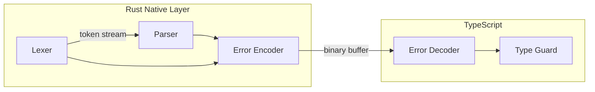

# Error Handling

Atchara uses discriminated unions for type-safe error handling. Errors are encoded in the Rust native layer as binary data, then decoded and thrown as structured JavaScript Error objects in TypeScript.

## Error Types

All errors extend `Error` with `name: 'AtcharaError'`, a `code`, and error-specific properties:

```typescript
type AtcharaError =
  | UnexpectedEof // No position, no details
  | InvalidUtf8 // position + details.rawMessage
  | UnexpectedCharacter // position + details.character
  | ValidationError // position + details.expected, details.found
  | MissingRequired // position + details.field
  | UnexpectedField // position + details.field
  | UnionNoMatch // position + details.variantErrors
  | InvalidSchema // No position, no details
```

### Error Reference

| Code                   | Cause                          | Position | Details                             |
| ---------------------- | ------------------------------ | -------- | ----------------------------------- |
| `UNEXPECTED_EOF`       | Input ends unexpectedly        | No       | None                                |
| `INVALID_UTF8`         | Invalid byte sequence          | Yes      | `rawMessage: string`                |
| `UNEXPECTED_CHARACTER` | Invalid JSON character         | Yes      | `character: string`                 |
| `VALIDATION_ERROR`     | Type/value mismatch            | Yes      | `expected: string`, `found: string` |
| `MISSING_REQUIRED`     | Required object field absent   | Yes      | `field: string`                     |
| `UNEXPECTED_FIELD`     | Unknown field (strict objects) | Yes      | `field: string`                     |
| `UNION_NO_MATCH`       | No union variant matched       | Yes      | `variantErrors: AtcharaError[]`     |
| `INVALID_SCHEMA`       | Invalid schema structure       | No       | None                                |

## Usage

### Type Guard

```typescript
import { isAtcharaError } from 'atchara'

try {
  parser.parse(input)
} catch (e) {
  if (isAtcharaError(e)) {
    console.log(e.code, e.message)
  }
}
```

### Type Narrowing

The discriminated union allows TypeScript to narrow error types based on `code`:

```typescript
if (isAtcharaError(e)) {
  switch (e.code) {
    case 'VALIDATION_ERROR':
      console.log(`Expected ${e.details.expected}, got ${e.details.found}`)
      break
    case 'MISSING_REQUIRED':
      console.log(`Missing field: ${e.details.field}`)
      break
    case 'UNION_NO_MATCH':
      for (const variantError of e.details.variantErrors) {
        console.log(variantError.message)
      }
      break
  }
}
```

## Error Flow



**Flow:**

1. Lexer/Parser detects error condition
2. Rust encoder serializes error to binary format
3. Binary buffer returned with `0x01` discriminator
4. TypeScript decoder reconstructs `AtcharaError`
5. Error thrown for user to catch

The binary encoding approach eliminates N-API exception overhead while preserving full error information.

## Union Errors

`UNION_NO_MATCH` collects errors from each variant attempt:

```typescript
// Schema: union([string(), number()])
// Input: true

{
  code: 'UNION_NO_MATCH',
  message: 'No union variant matched at line 1, column 1...',
  position: { line: 1, column: 1 },
  details: {
    variantErrors: [
      { code: 'VALIDATION_ERROR', message: '...', position: {...}, details: { expected: 'string', found: 'true' } },
      { code: 'VALIDATION_ERROR', message: '...', position: {...}, details: { expected: 'number', found: 'true' } }
    ]
  }
}
```

## Position Tracking

- Positions are **1-indexed** (line 1, column 1 is the first character)
- `UNEXPECTED_EOF` and `INVALID_SCHEMA` have no position
- Position indicates where the error was detected in the input
