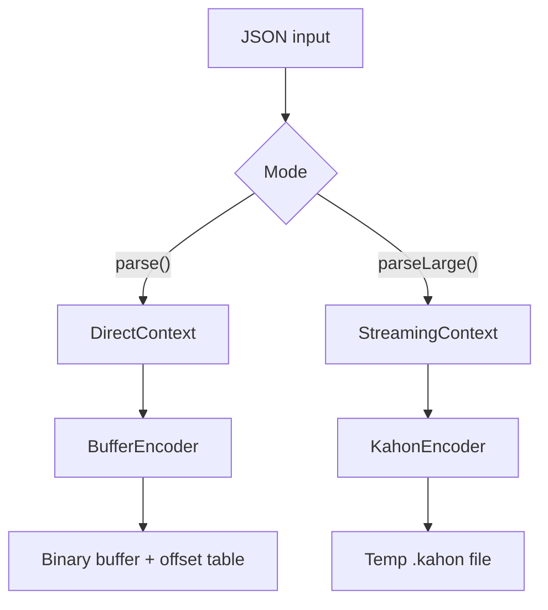

# Native Architecture

The Rust native layer handles lexing, parsing, and binary encoding via N-API.

## Data Flow



Two parsing modes share the same schema-driven parser logic but differ in input handling and output storage.

## N-API Interface

```rust
#[napi]
pub struct Atchara {
    schema: Rc<Schema>,  // Deserialized once at construction
}

#[napi]
impl Atchara {
    fn new(schema_js: Object) -> Self;
    fn parse(&self, input: &[u8]) -> (bool, Buffer);
    fn create_streaming_session(&self) -> StreamingSession;
}

#[napi]
pub struct StreamingSession { ... }

#[napi]
impl StreamingSession {
    fn feed(&mut self, chunk: Buffer) -> (i32, Buffer);
    fn finish(&mut self) -> (bool, Buffer, Option<KahonHandle>);
    fn abort(&mut self) -> ();
}
```

- `parse()` returns `(is_error, bytes)` — error bytes or value data + offset table
- `create_streaming_session()` returns a `StreamingSession` for incremental parsing
- `feed()` accepts chunks, returns status (`1` = ok, `-1` = error with error bytes)
- `finish()` completes parsing, returns error or a `KahonHandle` whose temp `.kahon` file the JS side opens for lazy reads

## Components

### ByteStream (`parser/bytes.rs`)

Tracks input position with line/column for error reporting:

- `peek_byte()` / `advance_byte()` - single byte access
- `remaining()` - slice of unconsumed input
- `snapshot()` / `restore()` - state save/restore for union backtracking
- `track()` / `track_span()` - branchless line/column tracking

### DirectContext (`direct.rs`)

Used by `parse()` for full documents. Wraps a borrowed byte slice (`&[u8]`) with a `BufferEncoder` that writes to an in-memory buffer.

### StreamingContext (`streaming.rs`)

Used by `parseLarge()` for incremental parsing. Manages a growable input buffer with compaction:

- **Committed position**: Bytes before this point are safe to discard
- **Compaction threshold**: 64KB — committed bytes discarded when exceeded
- **Union safety**: `in_union_depth` counter prevents compaction during backtracking

### StorageEncoder Trait (`encoder.rs`)

Shared abstraction for encoding validated values to storage:

```rust
trait StorageEncoder {
    fn write_string(&mut self, value: &str);
    fn write_number(&mut self, value: f64);
    fn begin_object(&mut self, field_count: usize) -> ObjectHandle;
    fn begin_array(&mut self) -> ArrayHandle;
    // ... other types
}
```

Two implementations:

- **BufferEncoder** — writes to in-memory `Vec<u8>` with offset table (direct mode)
- **KahonEncoder** — streams to a temp `.kahon` file via `kahon::raw::RawWriter` (streaming mode)

### Parser (`parser/mod.rs`)

Schema-driven parser that dispatches based on `SchemaKind`:

```rust
match &schema.kind {
    SchemaKind::String => self.parse_string(encoder),
    SchemaKind::Number => self.parse_number(encoder),
    SchemaKind::Object(fields) => self.parse_object(fields, encoder),
    // ... other types
}
```

Each type parser:

1. Validates JSON structure against schema
2. Writes values directly to encoder (buffer or kahon)
3. Returns error with position on validation failure

## SIMD Optimizations

### Whitespace (`parser/whitespace.rs`)

Uses portable SIMD (`std::simd`) to process 16 bytes at a time:

- Compares against all 4 RFC 8259 whitespace chars (space, tab, LF, CR)
- Extracts bitmask to find first non-whitespace
- Falls back to scalar for remaining bytes

### String Scanning (`parser/string.rs`)

Two-phase approach:

1. **Scan phase:** SIMD finds string end and escape positions
   - Detects quotes, backslashes, control characters in parallel
   - Uses simdjson-style algorithm for handling consecutive backslashes
2. **Build phase:** Constructs string from scan result
   - Fast path: no escapes - direct UTF-8 validation via `simdutf8`
   - Slow path: processes escapes including `\uXXXX` and surrogate pairs

### Character Classification (`parser/classifier.rs`)

256-byte lookup table for O(1) character classification (whitespace, structural chars).

## Schema Types

```rust
pub enum SchemaKind {
    String,
    Number,
    Integer,          // JS safe integer range validation
    Boolean,
    Null,
    Literal(LiteralValue),
    Object(ObjectFieldMap),  // HashMap for O(1) field lookup
    Array(Box<Schema>),
    Tuple(Vec<Schema>),
    Nullable(Box<Schema>),
    Optional(Box<Schema>),
    Record(Box<Schema>),
    Union(Vec<Schema>),
}
```

**Integer validation:** Checks value is in JavaScript safe integer range (`-(2^53-1)` to `2^53-1`).

**Union parsing:** Tries each variant in order with backtracking. First successful match wins.

## Error Handling

```rust
pub enum AtcharaError {
    UnexpectedEof,
    InvalidUtf8 { message, line, column },
    UnexpectedCharacter { char, line, column },
    ValidationError { expected, found, line, column },
    MissingRequired { field, line, column },
    UnexpectedField { field, line, column },
    UnionNoMatch { variant_errors, line, column },
    InvalidSchema(String),
}
```

Errors convert to JavaScript `Error` objects with:

- `name`: `"AtcharaError"`
- `code`: Error code string (e.g., `"VALIDATION_ERROR"`)
- `position`: `{ line, column }` (1-indexed)
- `details`: Error-specific data

See [Error Handling](./error-handling.md) for full details.

## kahon Integration

The streaming mode persists parsed values as a [kahon](https://github.com/jankdc/kahon)
binary document on disk. kahon containers are bulk-loaded B+trees with
absolute byte offsets, so the JS reader does true random-access lookups
without scanning.

- **Streamed writes**: `kahon::raw::RawWriter<File>` emits scalars
  immediately and buffers per-frame B+tree state — memory bounded by
  tree depth, not document size.
- **Schema overlay**: schema-only types map onto JSON-domain values:
  unions become `[index, value]` 2-arrays, nullable fields become null
  or the inner value, optional absence omits the parent's key.
- **Trailer snapshots**: `parseEach` calls `RawWriter::snapshot_trailer()`
  at top-level array element boundaries to synthesize closing bytes for
  the in-progress document; the JS side stitches those bytes over the
  live file with a `SnapshotByteSource`.
- **Session lifecycle**: `KahonHandle` (parseLarge) / `IteratingHandle`
  (parseEach) own the temp file path and delete it on `close()` or GC.

## Performance Features

- **mimalloc allocator:** Global allocator for better allocation performance
- **Reusable temp buffer:** Avoids allocation per nested structure
- **Inline hints:** Critical paths marked `#[inline(always)]`
- **Release profile:** LTO enabled, single codegen unit for maximum optimization
