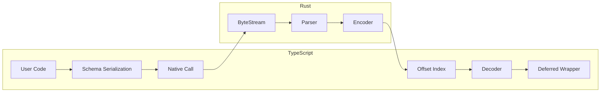

# Parsing Flow

End-to-end example parsing `{"name":"John","age":30}` with lazy access.

## Overview



## Setup

```typescript
const User = object({
  name: string(),
  age: number(),
})

const result = User.parse(input)
```

## Step 1: Schema Serialization

TypeScript schema classes serialize to a JSON structure passed to Rust. Each node gets a `schemaIndex` for the offset table.

```json
{
  "kind": "object",
  "schemaIndex": 0,
  "objectFields": [
    { "key": "name", "index": 0, "schema": { "kind": "string", "schemaIndex": 1 } },
    { "key": "age", "index": 1, "schema": { "kind": "number", "schemaIndex": 2 } }
  ]
}
```

## Step 2: Native Parsing

The Rust parser processes JSON bytes directly against the schema:

1. **ByteStream** - Reads UTF-8 bytes with position/line/column tracking
2. **Parser** - Schema-driven validation that consumes bytes and writes binary
3. **Encoder** - Writes compact binary format and records offsets

### Binary Output Format

Objects use a fixed-size offset table for O(1) field access (no field names stored):

```
// Object offset table (2 fields)
[0x00000000]       // offset[0] = 0 (name starts at values+0)
[0x00000008]       // offset[1] = 8 (age starts at values+8)
// Field values in schema order
[0x00000004]       // string length: 4
[J][o][h][n]       // UTF-8 bytes "John"
[30.0 as f64]      // 8 bytes, big-endian
```

### Global Offset Table

Appended after value data for O(1) random access by schema index:

```
[...value data...]
[offset_0: u32]     // byte offset for schemaIndex 0 (object)
[offset_1: u32]     // byte offset for schemaIndex 1 (name)
[offset_2: u32]     // byte offset for schemaIndex 2 (age)
[count: u32]       // number of offsets (3)
```

## Step 3: TypeScript Decoding

Binary returns to TypeScript where:

1. **OffsetIndex** - Reads offset table from end of binary
2. **MemoryStore** - Maps paths to offsets, provides lazy value access
3. **Decoder** - Reads binary values on demand using schema structure

## Step 4: Deferred Access

The result is wrapped in deferred types that decode lazily:

```typescript
const result = User.parse(input)
// result is DeferredObject<{ name: string; age: number }>

// Values decoded on access:
result.get('name').toValue() // seeks to offset, decodes "John"
result.get('age').toValue() // seeks to offset, decodes 30

// Or materialize entire object:
result.toValue() // { name: "John", age: 30 }
```

## Streaming Flow (parseLarge)

For large documents, `parseLarge()` uses a streaming pipeline:

```mermaid
flowchart LR
    subgraph TypeScript
        A[User Code] --> B[Readable Stream]
        B --> C[StreamingSession.feed]
        H[RedbStore] --> I[Deferred Wrapper]  // backed by RedbClient
    end
    subgraph Rust
        C --> D[StreamingContext]
        D --> E[Parser]
        E --> F[RedbEncoder]
        F --> G[redb Database]
    end
    G --> H
```

1. **Chunks fed** — `Readable` stream chunks passed to `StreamingSession.feed()`
2. **Incremental parsing** — `StreamingContext` manages a growable buffer, parses as data arrives
3. **redb writes** — `RedbEncoder` writes values to redb with path-based keys
4. **Finish** — `StreamingSession.finish()` returns a `RedbClient` handle
5. **Deferred access** — `RedbStore` wraps the client, deferred wrappers read values on demand
6. **Cleanup** — `result.close()` releases redb resources

## Binary Format Reference

See [Binary Format Specification](./binary-format.md) for complete encoding details.

## Error Handling

Parser validates tokens against schema during parsing:

```
Input: {"name":"John","age":"thirty"}
Error: ValidationError { expected: "number", found: "string", line: 1, column: 22 }
```

Errors include position information for debugging.
