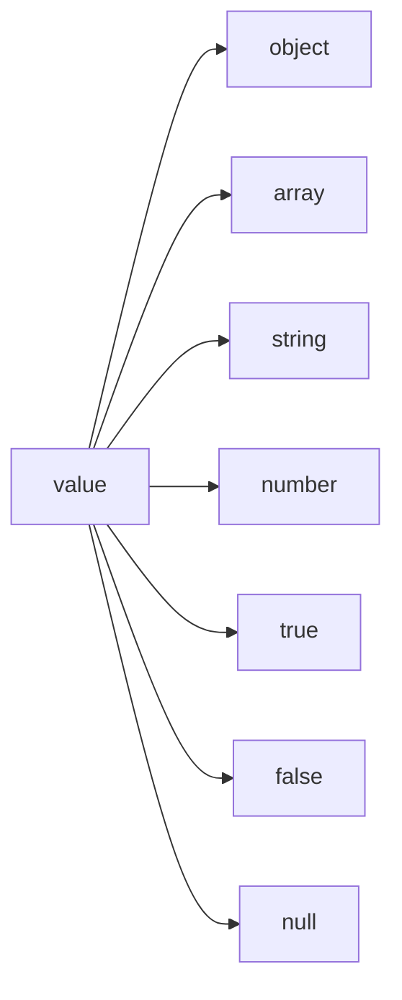

# RFC 8259 Compliance

Atchara implements strict JSON compliance per RFC 8259. The native Rust parser validates all input against the standard.

## Values



**Literals** must be exact lowercase: `true`, `false`, `null`.

## Strings

**Encoding**: UTF-8 input validated via `simdutf8`. Invalid byte sequences rejected.

**Escape sequences** (all required by RFC 8259):
| Escape | Character |
|--------|-----------|
| `\"` | Quotation mark |
| `\\` | Reverse solidus |
| `\/` | Solidus |
| `\b` | Backspace (U+0008) |
| `\f` | Form feed (U+000C) |
| `\n` | Line feed (U+000A) |
| `\r` | Carriage return (U+000D) |
| `\t` | Tab (U+0009) |
| `\uXXXX` | Unicode code point |

**Unicode escapes**:

- 4 hex digits required (case-insensitive)
- Surrogate pairs supported: `\uD83D\uDE00` decodes to U+1F600
- Lone surrogates rejected (U+D800-U+DFFF without valid pair)

**Control characters** (U+0000-U+001F): Must be escaped. Unescaped control characters in strings are rejected.

## Numbers

```
number = [ "-" ] int [ frac ] [ exp ]
int    = "0" / ( digit1-9 *digit )
frac   = "." 1*digit
exp    = ( "e" / "E" ) [ "+" / "-" ] 1*digit
```

**Enforced rules**:

- No leading zeros: `01` rejected, `0.1` allowed
- No leading `+`: `+123` rejected
- Decimal requires trailing digits: `1.` rejected
- Exponent requires trailing digits: `1e` rejected
- No hex/octal/binary: `0x10`, `0o10`, `0b10` rejected
- No `NaN` or `Infinity` literals

**Precision**: Parsed as IEEE 754 double (f64). Very large exponents overflow to `Infinity`; very small underflow to `0`.

## Whitespace

Only four characters accepted between tokens:

- Space (U+0020)
- Tab (U+0009)
- Line feed (U+000A)
- Carriage return (U+000D)

Unicode whitespace (NBSP, en-space, line separator, etc.) is rejected.

## Structural Characters

| Character | Usage                |
| --------- | -------------------- |
| `{` `}`   | Object delimiters    |
| `[` `]`   | Array delimiters     |
| `:`       | Name/value separator |
| `,`       | Value separator      |

**Enforced**:

- No trailing commas: `[1,2,]` rejected
- No comments: `//` and `/* */` rejected
- Single root value only: `1 2` rejected

## Rejected Extensions

These non-standard JSON extensions are explicitly rejected:

- Comments (`//`, `/* */`)
- Trailing commas
- Single-quoted strings
- Unquoted object keys
- Hexadecimal numbers
- `NaN`, `Infinity`, `-Infinity`
- BOM (U+FEFF)

## Test Coverage

See `packages/atchara/tests/rfc-compliance.test.ts` for comprehensive validation tests covering:

- All whitespace handling
- Comment rejection
- UTF-8 encoding (BMP and supplementary planes)
- Input validation (empty, multiple values, trailing content)
- Structural validation
- Deep nesting
- Edge cases and stress tests
- Number precision boundaries
- Surrogate pair handling
