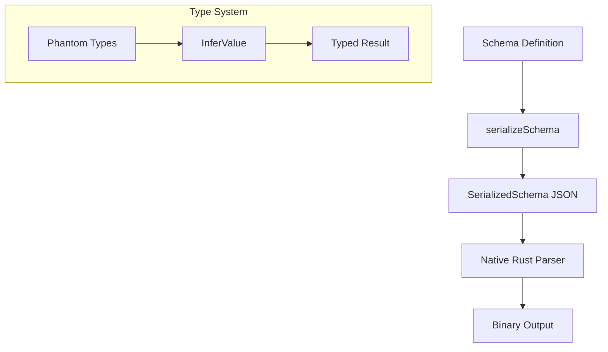

# Schema Layer

The schema layer provides compile-time type safety and runtime schema serialization for the native parser.

## Core Interface

```typescript
interface Schema<TOutput, TInput, TDeferred> {
  readonly _output: TOutput // Phantom type for parsed value
  readonly _input: TInput // Phantom type for input validation
  readonly _deferred: TDeferred // Phantom type for deferred access
  serializeSchema(counter: { value: number } | null): SerializedSchema
}
```

Phantom types (`_output`, `_input`, `_deferred`) exist only at compile time. TypeScript uses them for inference; they have no runtime representation.

## Schema Types

| Schema          | JSON         | TypeScript Output   |
| --------------- | ------------ | ------------------- |
| `string()`      | `"text"`     | `string`            |
| `number()`      | `123.45`     | `number`            |
| `integer()`     | `123`        | `number`            |
| `boolean()`     | `true/false` | `boolean`           |
| `literal(v)`    | exact value  | literal type        |
| `object({...})` | `{...}`      | typed object        |
| `array(T)`      | `[...]`      | `T[]`               |
| `tuple([...])`  | `[a,b,c]`    | `[A,B,C]`           |
| `record(T)`     | `{...}`      | `Record<string, T>` |
| `nullable(T)`   | `null` or T  | `T \| null`         |
| `optional(T)`   | missing or T | `T \| undefined`    |
| `union([...])`  | any variant  | `A \| B \| ...`     |

## Serialization

Schemas serialize to JSON for the native Rust parser. Each schema class implements `serializeSchema()`:

```typescript
// string() serializes to:
{ kind: 'string', schemaIndex: 0 }

// object({ name: string(), age: number() }) serializes to:
{
  kind: 'object',
  schemaIndex: 0,
  objectFields: [
    { key: 'name', index: 0, schema: { kind: 'string', schemaIndex: 1 } },
    { key: 'age', index: 1, schema: { kind: 'number', schemaIndex: 2 } }
  ]
}
```

The `schemaIndex` enables O(1) lookup in the binary format. A counter increments during serialization to assign unique indices.

## Type Inference

Container schemas compute output types from their children:

```typescript
// ObjectSchema infers output from shape
type ObjectOutput<T extends Record<string, Parser<Schema>>> = {
  [K in keyof T]: T[K]['schema']['_output']
}

// ArraySchema infers output from element type
type ArrayOutput<T extends Parser<Schema>> = T['schema']['_output'][]
```

Usage with `InferValue`:

```typescript
const User = object({
  name: string(),
  age: integer(),
  role: literal('admin'),
})

type User = InferValue<typeof User>
// { name: string; age: number; role: 'admin' }
```

## Optional vs Nullable

|            | `optional(T)`                    | `nullable(T)`                      |
| ---------- | -------------------------------- | ---------------------------------- |
| JSON       | field omitted or present         | value or `null`                    |
| TypeScript | `T \| undefined`                 | `T \| null`                        |
| Use case   | object fields that may be absent | values that can be explicitly null |

`optional()` is only valid within object fields. Using it in unions throws `INVALID_SCHEMA` at runtime.

## Object vs Record

|        | `object()`                  | `record()`          |
| ------ | --------------------------- | ------------------- |
| Keys   | fixed at schema time        | dynamic             |
| Type   | `{ name: string }`          | `Record<string, T>` |
| Binary | field indices (O(1) lookup) | string keys         |

Use `object()` when keys are known. Use `record()` for dynamic key-value maps.

## Architecture



Schema serialization happens once at parser construction. The native parser deserializes the schema once and reuses it for all parse calls.
